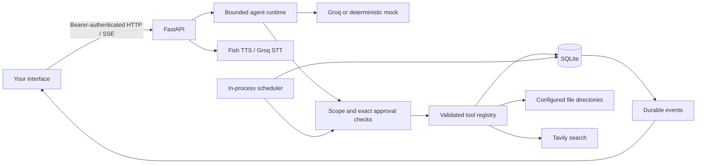

# Architecture

One FastAPI process owns the orchestrator, SQLite connection and scheduler. This
keeps the personal assistant deployable without a queue, vector database or
microservices. External calls use async HTTP; small SQLite transactions and bounded
file operations are synchronous. This is intended for personal, low-concurrency
use rather than a high-throughput multi-tenant service.

## Modules

| Module | Responsibility |
| --- | --- |
| `config.py` | Validated environment settings and secret wrappers |
| `api.py` | HTTP contract, body/auth guard, SSE, lifecycle and process lock |
| `runtime.py` | Context, model/tool loop, limits, cancellation and terminal states |
| `providers.py` | Real provider protocols, bounded retry and deterministic mock |
| `tools.py` | Metadata, input/output validation and backend authorization |
| `files.py` | Allowed-root checks and bounded UTF-8 operations |
| `store.py` | Storage abstraction and serialized transactions |
| `scheduler.py` | Persisted wall-clock schedules and atomic local executions |
| `security.py` | Stable errors, redaction and canonical action digests |
| `prompts/system.txt` | Editable personality and runtime instructions |

## Persistence

Numbered SQL migrations run at startup. Conversations/messages, explicit memory
items, task/note items, runs/events, approvals, jobs/executions and audit metadata
have distinct purposes and queries. Items share one typed table with a `kind`
column. Every user-owned resource has an owner; the single configured API token
maps to `local`. There is no client-supplied owner impersonation mechanism.

Conversation continuation reloads bounded recent history. Memory retrieval uses
literal lexical relevance and injects at most five active matches as untrusted
data. This release does not synthesize conversation summaries or use embeddings;
old conversation text remains available through the conversation endpoint.

## Authorization and trust

The model can request tools but cannot modify allowed roots, standing permissions,
or run scopes. A client grants exact tool names in the authenticated run request.
Reads of local task/note/memory/reminder data and the clock are enabled by default.
External search and file access need explicit capability grants. Reversible local
writes need a matching per-run grant or an exact standing permission.

Standing grants are exact tool names, never wildcards. They apply to all targets
reachable by that tool within the configured owner/roots, so a per-run grant is
the narrower default. A future connector should add target constraints to its own
schema/policy and must not assume a model's claim of user consent is sufficient.

Destructive actions store canonical normalized arguments and a SHA-256 digest.
The client receives a concrete preview and expiration. A decision must match the
digest; an atomic transition consumes approval once. Rejection, expiration,
cancellation, restart, changed arguments and reuse prevent execution. The model
has no approval-decision tool. Direct authenticated resource routes are explicit
user actions and still gate destructive tool operations. Conversation DELETE is
itself exact authorization and has no model-accessible equivalent.

These controls stop retrieved instructions from gaining capabilities. They do
not prove that every model-proposed action within an already granted broad tool
scope matches user intent. Grant only capabilities needed for the current run;
review destructive previews. File roots must be controlled by the trusted local
user. Checks reject symlinks/junctions and hard links, but do not claim isolation
from a hostile OS user concurrently changing filesystem components.

## Lifecycle and limits

Only one active run per conversation is permitted; global active runs, execution
time, tool count, context characters and output tokens are bounded. Unsupported
tools and invalid arguments produce structured tool errors. Provider failures
produce durable failed runs. Cancellation preserves records of already completed
actions and stops waiting/provider work where possible. Shutdown cancels active
runs. After an abrupt restart, unfinished runs become failed with
`service_restarted`; the application never replays potentially effectful tools.

SSE event IDs are durable, globally increasing SQLite IDs. Response deltas are
buffered per model turn for redaction. Important events and final status commit
durably. Final answer/message and terminal event commit together. Tool audit data
records hashes, identifiers, decisions and latency instead of full arguments.
Run tool-completed events do retain sanitized results to support honest execution
history; treat the database as private user data.

## Provider contract references

Implementation was checked against official documentation on 2026-09-23:

- [Groq Chat Completions](https://console.groq.com/docs/api-reference)
- [Groq local tool calling](https://console.groq.com/docs/tool-use/local-tool-calling)
- [Groq speech recognition](https://console.groq.com/docs/speech-to-text)
- [Fish Audio text-to-speech](https://docs.fish.audio/api-reference/endpoint/openapi-v1/text-to-speech)
- [Tavily search](https://docs.tavily.com/documentation/api-reference/endpoint/search)

Endpoints are fixed HTTPS URLs with no redirect following or environment proxy
inheritance. There is no arbitrary URL fetcher, removing an SSRF entry point.
Keys remain backend-only. Transient model/search failures have bounded exponential
backoff; partial model content is not retried after emission by the adapter. Voice
requests are not automatically retried to avoid duplicate billable generation.
Provider-reported usage is preserved; mock runs invent no token counts or costs.
